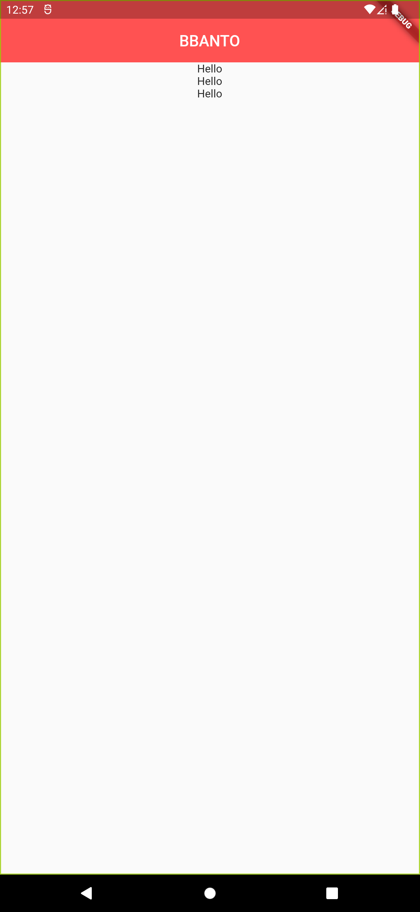

# What is Widget in flutter?
- UI를 만들고 구성하는 모든 기본 단위 요소
    - text, icon, image, text field, button
- 눈에 보이지 않는 요소들까지 Widget
    - center, column, padding
- Everything is a widget
    - 하나하나가 Widget, Widget들을 모아서 만들어진 App도 Widget

# Types of Widgets
- Stateless와 Stateful의 일반적인 의미
    1. Stateful => Value 값을 지속적으로 추적 보존
    2. Stateless => 이전 상호작용의 어떠한 값도 저장하지 않음

- Stateless Widget
    - 상태가 없는 정적인 Widget
    1. 스크린상에 존재만 할 뿐 아무것도 하지 않음
    2. 어떠한 실시간 데이터도 저장하지 않음
    3. 어떤 변화(모양, 상태)를 유발시키는 value값을 가지지 않음
- Stateful Widget
    - 계속 움직임이나 변화가 있는 Widget
    1. 사용자의 interaction에 따라서 모양이 바뀜 (text field, checkbox, radiobutton)
- Inherited Widget

# Flutter Widget Tree
1. Widget들은 tree 구조로 정리될 수 있음
2. 한 Widget내에 얼마든지 다른 widget들이 포함될 수 있음
3. Widget은 부모 위젯과 자식 위젯으로 구성
4. Parent widget을 widget container라고 부르기도 함

# Summary 1
1. Flutter의 모든 것은 Widget
2. 위젯이 전혀 변화가 없으면 stateless widgets
3. 위젯의 모양이나 상태가 바뀐다면 stateful widgets
4. 위젯은 트리구조로 구성되어 있다

# pubspec.yaml
- 앱을 만들때 앞으로 자주 사용해야 하는 파일
- 프로젝트의 메타데이터를 정의하고, 관리
- 프로젝트의 사용환경, dart의 버전, 각종 dependency, 서드파티 라이브러리 등을 정의

# android, ios directory
- 관련 앱 빌드를 위한 정의

# lib directory
- main.dart 파일이 있는 폴더

# package:flutter/material.dart
- material: 모바일 데스크탑 그외 다양한 디바이스를 아우르는 일관된 디자인을 위한 가이드라인
- flutter는 material 디자인을 채택해 ui를 구성한다.

# primarySwatch
- 특정색을 기본색으로 지정하겠다.
- swatch = 견본

# Center와 Column의 만남
```
Center(
    child: Column(
        mainAxisAlignment: MainAxisAlignment.center,
        children: <Widget>[
        Text("Hello"),
        Text("Hello"),
        Text("Hello"),
        ],
    ),
),
```


```
Center(
    child: Column(
        // mainAxisAlignment: MainAxisAlignment.center,
        children: <Widget>[
        Text("Hello"),
        Text("Hello"),
        Text("Hello"),
        ],
    ),
),
```


- summary : Center는 "상하", Column은 "좌우"

# Class and Widget
- Class { 속성: 액정, 카메라 모듈, 홈버튼, 스크린 기능: 전화 걸기, 사진찍기, 인터넷 검색}
- 인스턴스 : Class로 정의된 설계대로 만들어진 사물
- 프로그래밍 상에서의 클래스란?
    - 객체가 가져야 하는 속성과 기능을 정의한 내용을 담고 있는 설계도 역할
- 프로그래밍 상에서의 객체란?
    - 클래스가 정으된 후 메모리상에 할당되었을 때 이를 객체라고 함
- 프로그래밍 상에서의 인스턴스란?
    - 클래스를 기반으로 생성 됨
    - 클래스의 속성과 기능을 똑같이 가지고 있고, 프로그래밍 상에서 사용되는 대상
```dart
class Person {
    String name;
    // var name = 'John';
    int age;
    String sex;
}

void main() {
    Person p1 = new Person();
    p1.age = 29;
    print(p1.age);
}
```

- 생성자와 관련된 함수의 구조와 기능
- 생성자의 구조와 역할
- 클래스와 위젯의 관계
```dart
class Person {
    String name;
    int age;
    String sex;

    Person(String name, int age, String sex) {
    // Person({String name, int age, String sex}) { // optional    
        this.name = name;
        this.age = age;
        this.sex = sex;
    }
}

void main() {
    Person p1 = new Person("JH", 29, "male");
    Person p2 = new Person("doyou", 25, "female");
    print(p1.age);  // 29
    print(p2.age);  // 25
}

new Scaffold()
```

# BuildContext
- "Scaffold.of() called with a context that does not contain a Scaffold"
- "A handle to the location of a widget in the widget tree."
    - "widget tree에서 현재 widget의 위치를 알 수 있는 정보"
<br>
- build method는 "Scaffold Widget"을 리턴하는데, 이때 widget tree상에서 "어디"에 위치하는 지에 대한 정보를 가진 "context"를 함께 리턴한다.
- 모든 widget은 자신만의 BuildContext를 가지고 있다. 
- 이 BuildContext는 stateless 위젯이나 state 빌드 메서드에 의해서 리턴된 위젯의 부모가 된다.
- Scaffold 위젯은 부모인 MyPage 위젯의 context를 물러받는다.
<br>
- MyPage widget build method -> (MyPage context) -> Scaffold Widget

# Scaffold.of(context) method
- "현재 주어진 context에서 위로 올라가면서 가장 가까운 Scaffold를 찾아서 반환하라."

# Snack bar and Toast message
1. 빌더 위젯없이 Snack bar 만들기
2. Toast message 구현하기

# Container
- Wrap with widget

# Navigator
1. Route의 개념
2. Navigator의 정의와 push, pop 함수, stack 자료구조
3. MaterialPageRoute위젯과 context
4. 페이지 이동 기능 구현 완성
<br>
- The navigator manages a stack of Route objects and provides methods for managing the stack, like Navigator.push and Navigator.pop.
<br>
- Navigator - stack 자료구조
    - pop method
    - push method

# Map 자료구조
- Key : Value
- Sea : 바다
- String : Widget builder

# Collection and Generic
1. String interpolation
```dart
void main() {
    String name = "Sean";
    print(name);

    print("Hi, $name, what's up?");
}
```

- $a님 반갑습니다 => 홍길동님 반갑습니다
- $b님 반갑습니다 => 두유님 반갑습니다
    - Interpolation: 보간법
        - 당신의 점수는 $score이며, 당신의 레벨은 $level입니다.

2. Collection / Generic
- Collection : 데이터들을 모아서 가지고 있는 자료구조
- Generic: Collection이 가지고 있는 데이터들의 데이터 타입을 지정
```dart
int addNumber(int num1, int num2) {
    return num1 + num2;
}

void main() {
    // var number = new List();
    // List number = new List(); // List<dynamic>
    /**
    List<dynamic> number = new List();
    
    number.add(2);
    number.add("test");
    number.add(7.4);
    number.add(addNumber(3, 4));
    number.add(true);
    print(number); // [2, test, 7.4, 7, true]
    */
    List<int> number = new List();
    number.add(2);
    number.add(addNumber(3, 4));

    List<string> str = new List();
    str.add("test");
}
```

# Generic 보충
- Not use Generic
```dart
/**
 * Not Use Generic
 */
class Circle {}
class Square {}
class SquareSlot {
    insert(Square sqareSlot) {

    }
}
class CircleSlot{
    insert(Circle circleSlot) {

    }
}

void main() {
    var circleSlot = new CircleSlot();
    circleSlot.insert(new Circle());
    var squareSlot = new SquareSlot();
    squareSlot.insert(new Square());
}
```
<br>
- Use Generic
```dart
    void main() {
        var circleSlot = new Slot<Circle>();
        circleSlot.insert(new Circle());

        var squareSlot = new Slot<Square>();
        squareSlot.insert(new Square());

        var triangleSlot = new Slot<Triangle>();
        triangleSlot.insert(new Triangle());
    }
    class Circle {}
    class Square {}
    class Triangle{}

    class Slot<T> {
        insert (T shape) {

        }
    }
```
- 더 유연하고, 확장성 있음

# ScaffoldMessenger
- Scaffold.of(context) method
    - Scaffold.of(context).showSnackBar(SnackBar(...))
- Why ScaffoldMessenger?
    - BuildContext and SnackBAr
        - Scaffold.of(context)는 부모 위젯 중 Scaffold를 찾게 됨.
        - Scaffold 위젯 내에서 Scaffold.of(context)를 사용하면, 위젯 내이므로, Scaffold를 찾지 못함.
        - Builder 위젯으로 감싸서 사용해야 했음.
        - ScaffoldMessager를 사용하면 Scaffold 위젯에서 곧바로 사용 가능.
- 특정 위젯에서만 Snackbar를 사용하고 싶다.
    - 특정 위젯에 ScaffoldMessenger 위젯를 최상위로 두고, 하위에 Builder 위젯을 두어 실제 UI를 위젯을 추가한다.
    - MyPage => ScaffoldMessenger => Scaffold => Builder

# Buttons
- RaisedButton => ElevatedButton
- FlatButton => TextButton
- OutlineButton => OutlinedButton