# animations

<h2>reference</h2>

<b>https://github.com/flutter/samples/tree/master/animations</b>

# related keyword(for study... update later)
- [extends ... with ...](https://picayune-judge-296.notion.site/Flutter-Dart-extends-vs-with-vs-implements-433ee1a5b93949b6aab705f9d7db178e)
- [GestureDetector](https://picayune-judge-296.notion.site/GestureDetector-Class-334f5de18c354b24943e02c46f012550)
- [GlobalKey](https://picayune-judge-296.notion.site/What-is-GlobalKey-c798840e51c14660a84903aec113058d)
- ElevatedButton
- ValueChanged<T>
- SingleTickerProviderStateMixin
- InputDecoration
- TextFormField(validator)
- WidgetsFlutterBinding
- SystemChrome
- SingleTickerProviderStateMixin
- lerp(Tween's override method)

# 결과물
## Basics

### AnimatedContainer
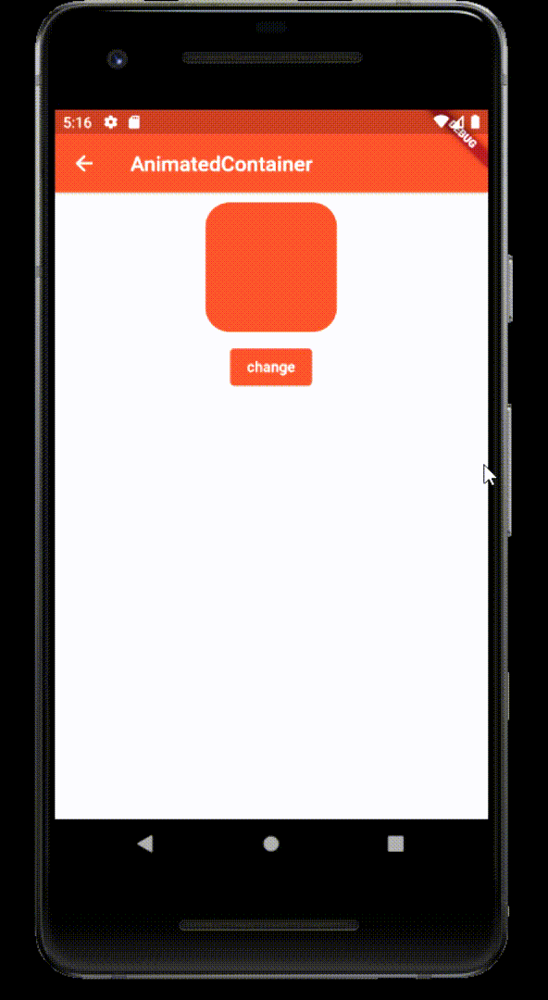

### PageRouteBuilder
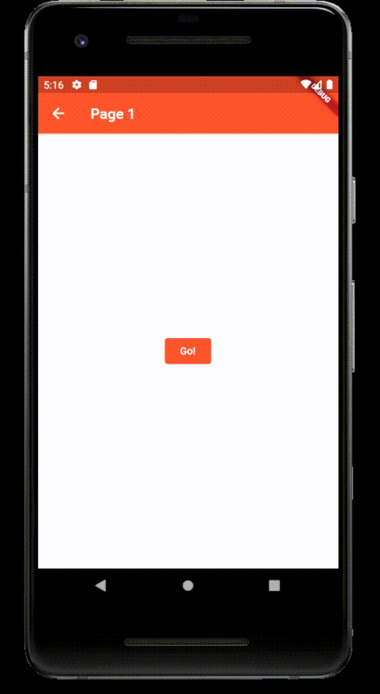

### AnimationController
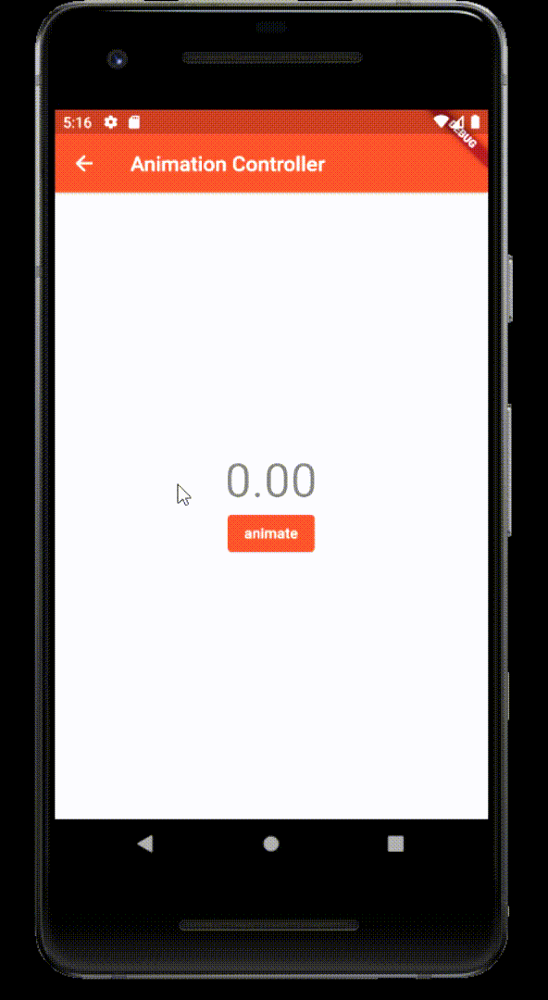

### Tweens
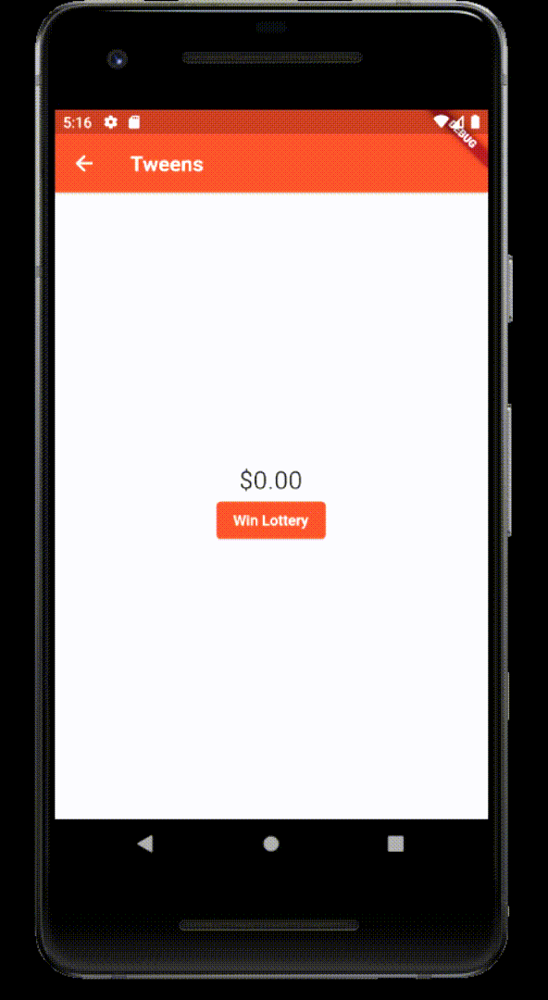

### AnimatedBuilder
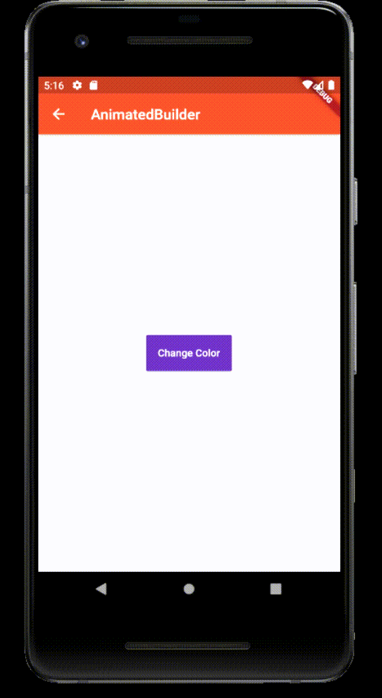

### CustomTween
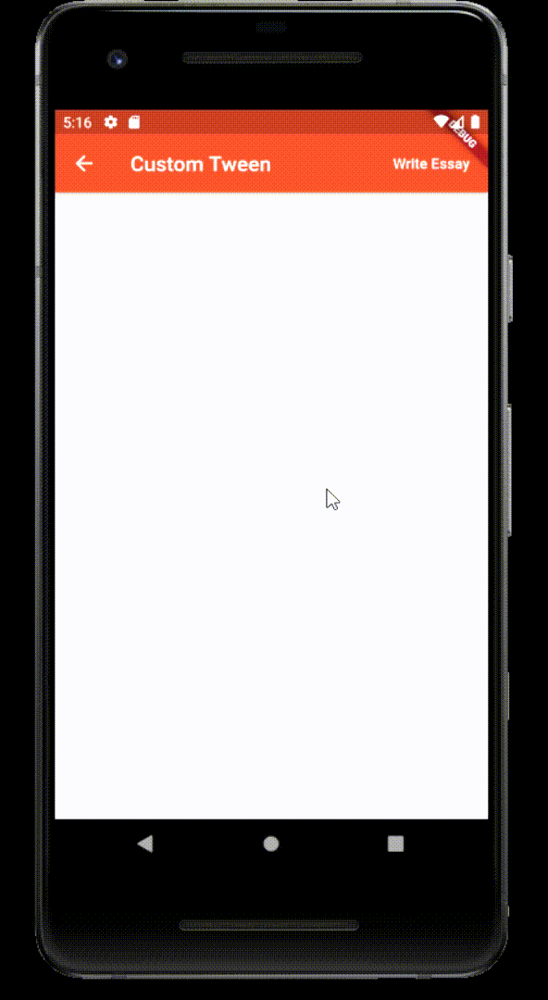

### FadeTransition
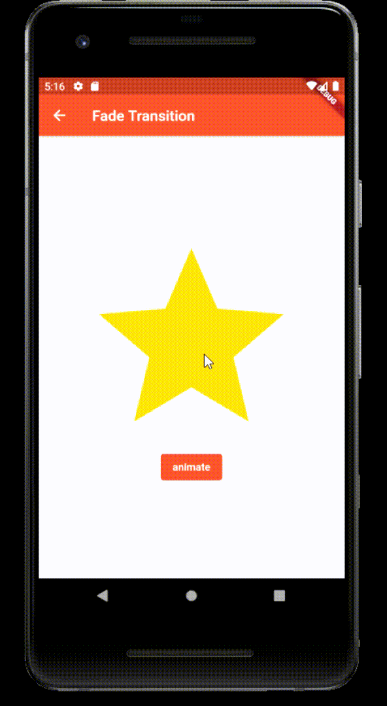

## Misc

### ExpandableCard

### Carousel

### FocusImage

### CardSwipe

### RepeatingAnimation
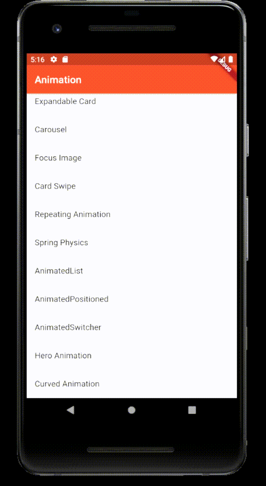

### SpringPhysics
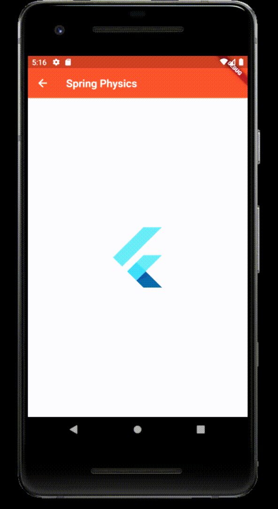

### AnimatedList
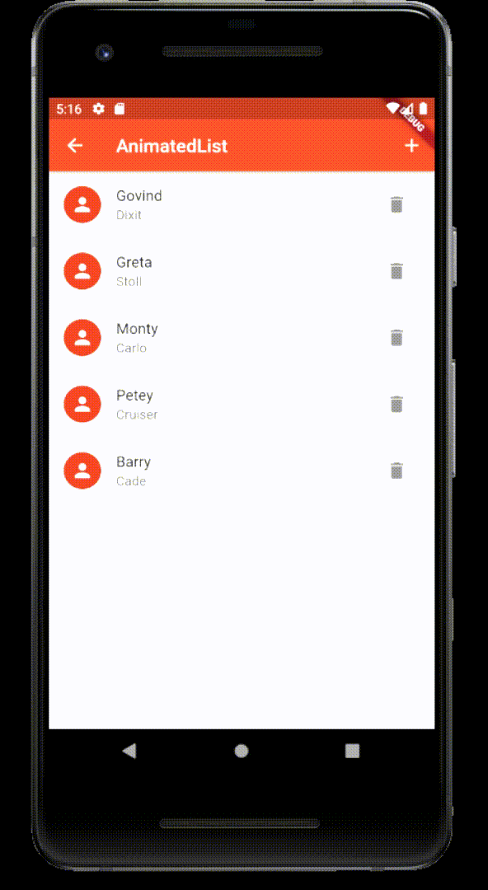

### AnimatedPositioned
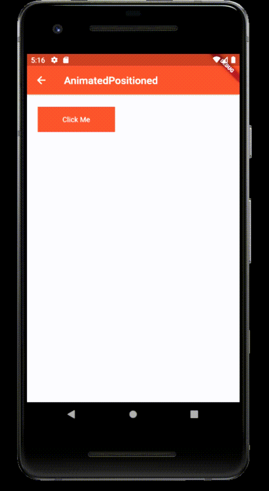

### AnimatedSwitcher
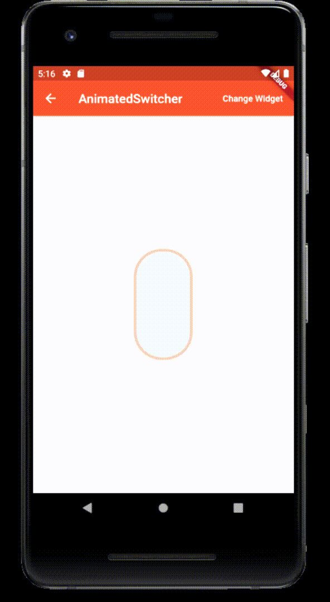

### HeroAnimation
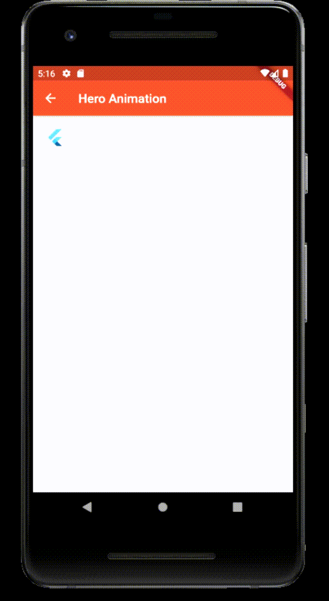

### CurvedAnimation
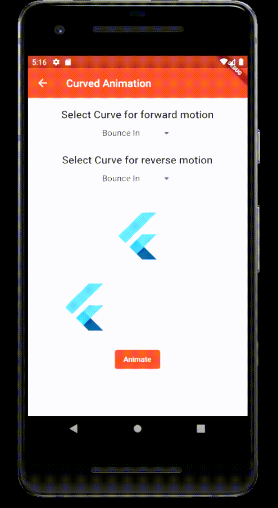
