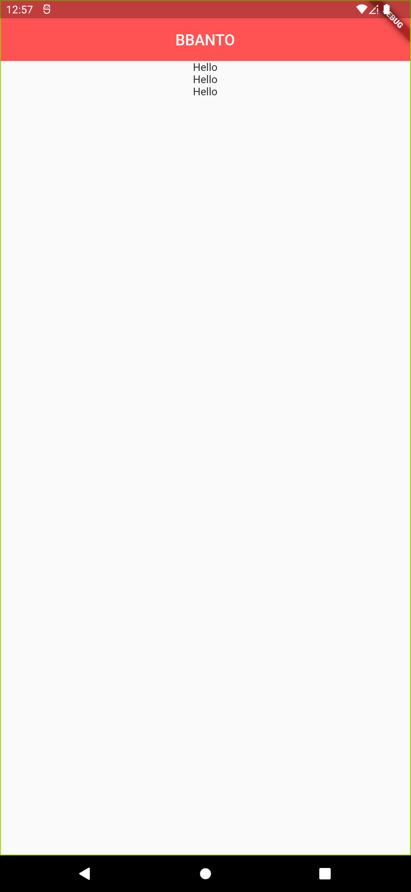

# What is Widget in flutter?
- UI를 만들고 구성하는 모든 기본 단위 요소
    - text, icon, image, text field, button
- 눈에 보이지 않는 요소들까지 Widget
    - center, column, padding
- Everything is a widget
    - 하나하나가 Widget, Widget들을 모아서 만들어진 App도 Widget

# Types of Widgets
- Stateless와 Stateful의 일반적인 의미
    1. Stateful => Value 값을 지속적으로 추적 보존
    2. Stateless => 이전 상호작용의 어떠한 값도 저장하지 않음

- Stateless Widget
    - 상태가 없는 정적인 Widget
    1. 스크린상에 존재만 할 뿐 아무것도 하지 않음
    2. 어떠한 실시간 데이터도 저장하지 않음
    3. 어떤 변화(모양, 상태)를 유발시키는 value값을 가지지 않음
- Stateful Widget
    - 계속 움직임이나 변화가 있는 Widget
    1. 사용자의 interaction에 따라서 모양이 바뀜 (text field, checkbox, radiobutton)
- Inherited Widget

# Flutter Widget Tree
1. Widget들은 tree 구조로 정리될 수 있음
2. 한 Widget내에 얼마든지 다른 widget들이 포함될 수 있음
3. Widget은 부모 위젯과 자식 위젯으로 구성
4. Parent widget을 widget container라고 부르기도 함

# Summary 1
1. Flutter의 모든 것은 Widget
2. 위젯이 전혀 변화가 없으면 stateless widgets
3. 위젯의 모양이나 상태가 바뀐다면 stateful widgets
4. 위젯은 트리구조로 구성되어 있다

# pubspec.yaml
- 앱을 만들때 앞으로 자주 사용해야 하는 파일
- 프로젝트의 메타데이터를 정의하고, 관리
- 프로젝트의 사용환경, dart의 버전, 각종 dependency, 서드파티 라이브러리 등을 정의

# android, ios directory
- 관련 앱 빌드를 위한 정의

# lib directory
- main.dart 파일이 있는 폴더

# package:flutter/material.dart
- material: 모바일 데스크탑 그외 다양한 디바이스를 아우르는 일관된 디자인을 위한 가이드라인
- flutter는 material 디자인을 채택해 ui를 구성한다.

# primarySwatch
- 특정색을 기본색으로 지정하겠다.
- swatch = 견본

# Center와 Column의 만남
```
Center(
    child: Column(
        mainAxisAlignment: MainAxisAlignment.center,
        children: <Widget>[
        Text("Hello"),
        Text("Hello"),
        Text("Hello"),
        ],
    ),
),
```


```
Center(
    child: Column(
        // mainAxisAlignment: MainAxisAlignment.center,
        children: <Widget>[
        Text("Hello"),
        Text("Hello"),
        Text("Hello"),
        ],
    ),
),
```


- summary : Center는 "상하", Column은 "좌우"

# Class and Widget
- Class { 속성: 액정, 카메라 모듈, 홈버튼, 스크린 기능: 전화 걸기, 사진찍기, 인터넷 검색}
- 인스턴스 : Class로 정의된 설계대로 만들어진 사물
- 프로그래밍 상에서의 클래스란?
    - 객체가 가져야 하는 속성과 기능을 정의한 내용을 담고 있는 설계도 역할
- 프로그래밍 상에서의 객체란?
    - 클래스가 정으된 후 메모리상에 할당되었을 때 이를 객체라고 함
- 프로그래밍 상에서의 인스턴스란?
    - 클래스를 기반으로 생성 됨
    - 클래스의 속성과 기능을 똑같이 가지고 있고, 프로그래밍 상에서 사용되는 대상
```dart
class Person {
    String name;
    // var name = 'John';
    int age;
    String sex;
}

void main() {
    Person p1 = new Person();
    p1.age = 29;
    print(p1.age);
}
```

- 생성자와 관련된 함수의 구조와 기능
- 생성자의 구조와 역할
- 클래스와 위젯의 관계
```dart
class Person {
    String name;
    int age;
    String sex;

    Person(String name, int age, String sex) {
    // Person({String name, int age, String sex}) { // optional    
        this.name = name;
        this.age = age;
        this.sex = sex;
    }
}

void main() {
    Person p1 = new Person("JH", 29, "male");
    Person p2 = new Person("doyou", 25, "female");
    print(p1.age);  // 29
    print(p2.age);  // 25
}

new Scaffold()
```